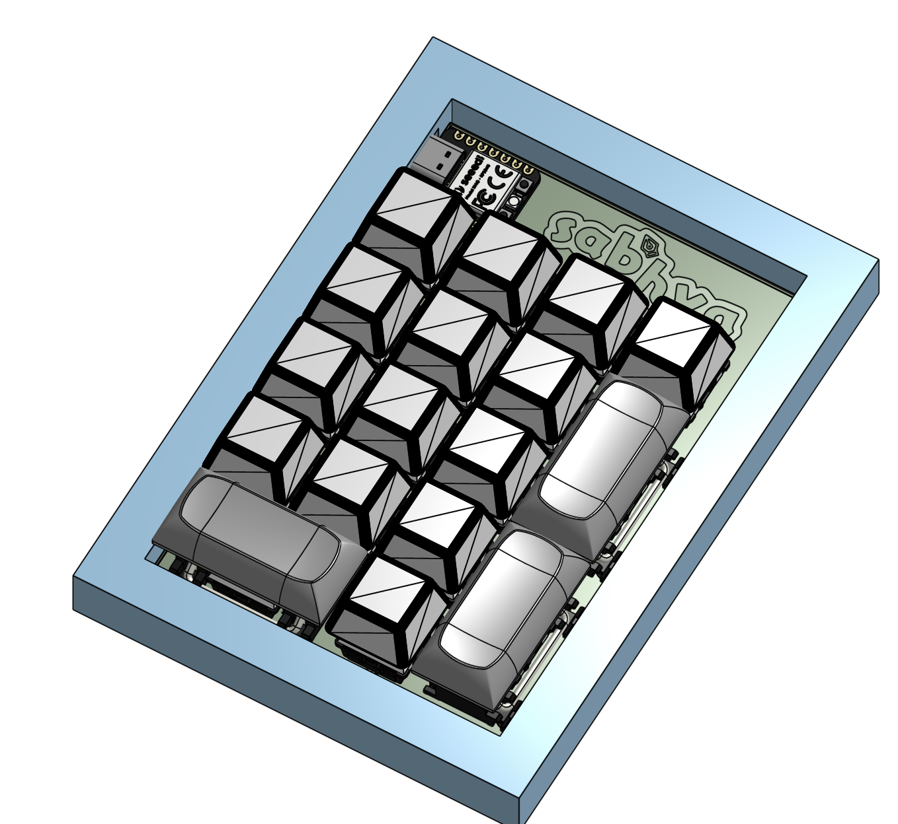
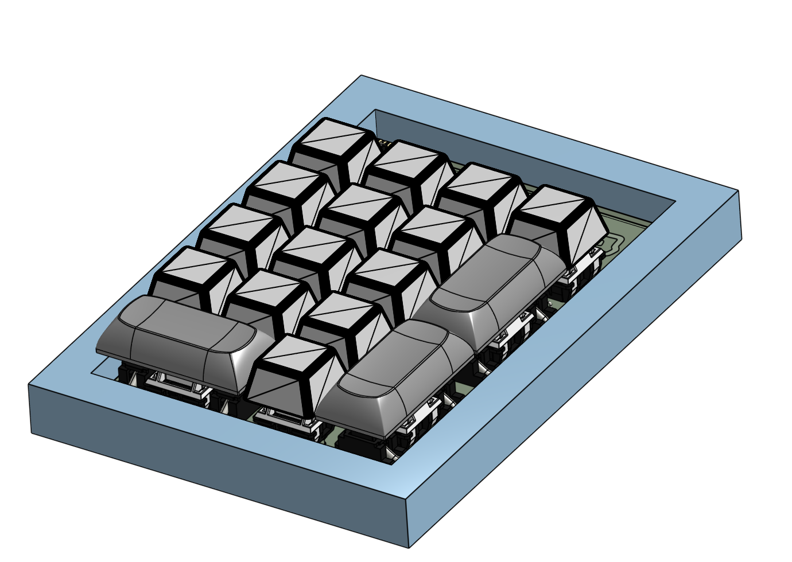
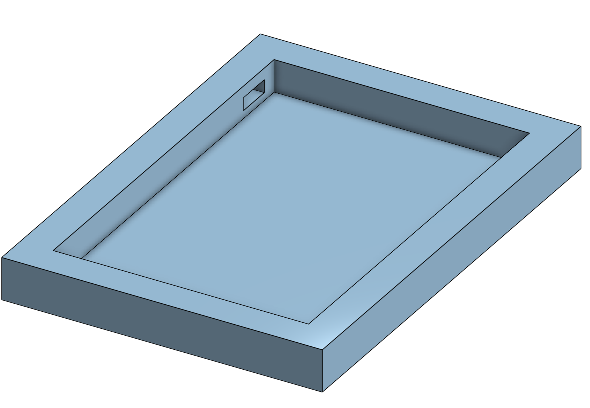
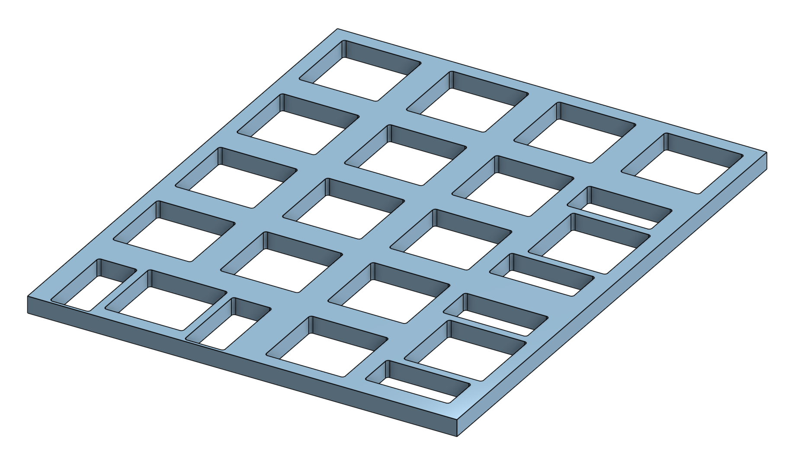
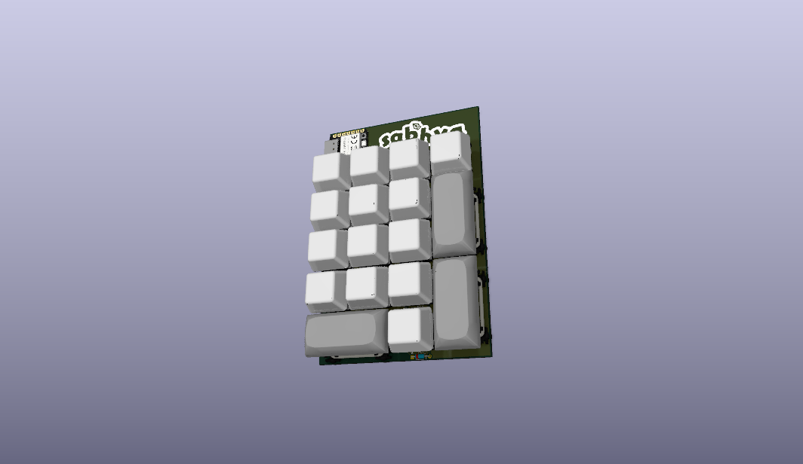
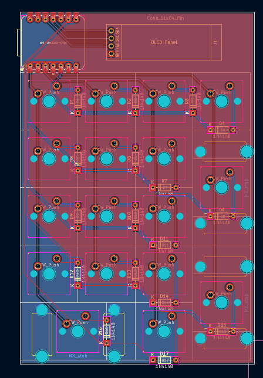
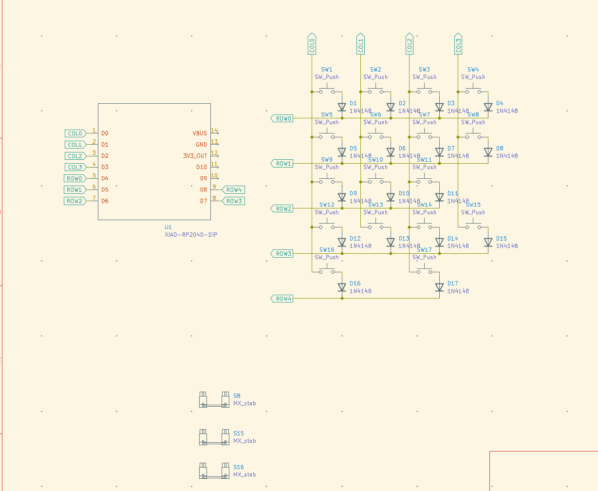

# Number Pad
This is a keyboard made by me that acts as a number pad for many keyboards today that don't include it, and it's designed for use in, say, the calculator app. The PCB was designed in Ki-CAD, the case was designed in Onshape, and it uses QMK firmware. As per me, the  design and shape is beautiful...

## BOM
|Name                    |Description                                                                        |Quantity|Total Cost|Link                                                                                                          |Distributor       |
|------------------------|-----------------------------------------------------------------------------------|--------|----------|--------------------------------------------------------------------------------------------------------------|------------------|
|PCB                     |Main PCB(includes payment fee)                                                     |1       |$1.36     |https://aivon.com/                                                                                            |AIVON             |
|Seeed Studio XIAO RP2040|Main Dev Board(cost includes shipping)                                             |1       |$8.72     |https://sharvielectronics.com/product/xiao-rp2040-supports-arduino-micropython-and-circuitpython-seeed-studio/|sharvi electronics|
|MX Switches             |MX switches(pack of 10 and 2 of them = 20 keys)(includes shipping)                 |2       |$5.11     |https://stackskb.com/store/click-inc-hp-switch-pack-of-10-pre-order/                                          |stackskb          |
|Keycaps                 |Numpad keycaps(shipping grouped with switches)                                     |1       |$1.57     |https://stackskb.com/store/numpad-keycaps/?attribute_variant=MDA+Lavender                                     |stackskb          |
|1N4148 Diode            |1N4148 Diode(price not include shipping as shipping is shared with the XIAO RP2040)|17      |$0.60     |https://sharvielectronics.com/product/1n4148-small-signal-fast-switching-diodes-do-35-package/                |sharvi electronics              |
|2u MX Stabilizers       |Stabilizers(shipping grouped with switches)                                        |3       |$3.13     |https://stackskb.com/store/genuine-cherry-mx-plate-mount-stabilizers-2u/                                      |stackskb          |

## Images

### CAD
#### 3D Renders of the Number Pad

#### 3D render of Case

#### 3D render of Plate

###### Note: Earlier I decided I would have an OLED. Later I decided I should not. [This](https://cad.onshape.com/documents/dad228ea60076f74a46a1f61/w/2f4558e967e48aff5bcd16fe/e/fbd68186b11d7caaa4edcef6?renderMode=0&uiState=6ab79fd89886a45a7fd9a169) link is for the one which shows the OLED would be there but actually we're not going to place it that way. I am just giving that link because it has the exact correct placements and it also has the plate and case Part Studio, and for the one with none. of them, it's [this](https://cad.onshape.com/documents/9043f20461557082fc912c61/w/6b8636902849ed63c82f6d7b/e/4d242b45682191a3636d33f8?renderMode=0&uiState=6ab79ffff660f4859433cc5e)...
### PCB

#### 3D render of PCB

#### PCB layout 

#### Schematic

